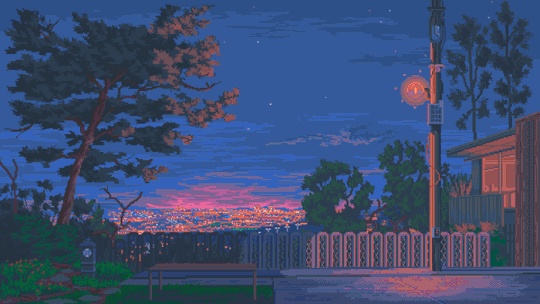

<table>
<tr>
    <td colspan="2">
This is me <b><u>Homs</u></b> and focus on <code>frontend</code> now

Feel free to contact me with <u>homs.hern.dev [at] gmail.com</u>
\
&nbsp;
        
    </td>
</tr>
<tr>
    <td>Languages</td>
    <td>
        
        
        
        
    </td>
</tr>
<tr>
    <td>Frontend</td>
    <td>
        
        
        
        
        
        
        
    </td>
</tr>
<tr>
    <td>Backend</td>
    <td>
        
        
        
        
        
    </td>
</tr>
<tr>
    <td>Database</td>
    <td>
        
        
        
        
    </td>
</tr>
<tr>
    <td>IDE</td>
    <td>
        
        
        
        
    </td>
</tr>
</table>

> Keywords: C#, Php, Java, Swift, HTML, CSS, Sass, Scss, Javascript, Vanilla JS, ESNext, Typescript, Nextjs, React, Redux, Redux-Saga, Redux-Observable, Nodejs, Deno, Express, Laravel, Dot Net, Spring, MySQL, MSSQL, MongoDB, Redis, VS Code, VS, Android, iOS, Xcode

<a href="mailto:homs.hern.dev@gmail.com">Contact Me</a> &nbsp;&nbsp; | &nbsp;&nbsp; 3↑ Years Work Experience &nbsp;&nbsp; | &nbsp;&nbsp; 10↑ Years Developing Experience
